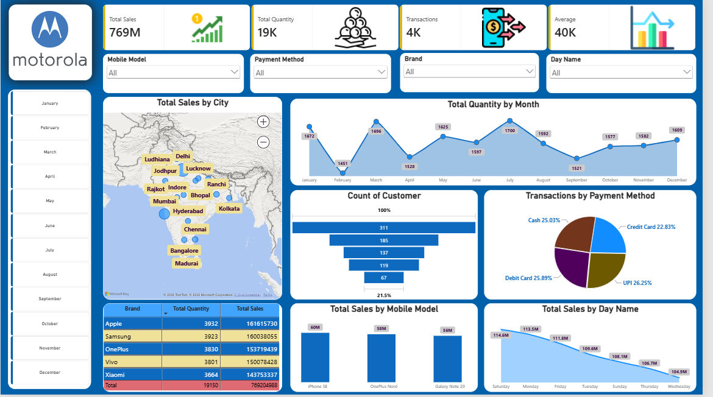

# 📱 Mobile Sales Dashboard | Power BI

An interactive **Power BI Dashboard** built using a real-world mobile sales dataset to analyze sales performance, customer behavior, payment methods, brands, and city-wise sales across India.

---

## 📸 Dashboard Preview

---

## 📌 Project Overview

This dashboard helps businesses monitor mobile sales performance through interactive KPIs and visualizations. Users can filter data by month, brand, payment method, and day to discover meaningful business insights.

---

## 🎯 Key KPIs

| KPI                    | Value    |
| ---------------------- | -------- |
| 💰 Total Sales         | **769M** |
| 📦 Total Quantity Sold | **19K**  |
| 🛒 Total Transactions  | **4K**   |
| 💵 Average Sales       | **40K**  |

---

## 📊 Dashboard Features

* 📈 Total Sales KPI Cards
* 🗺️ City-wise Sales Analysis using Map Visual
* 📅 Monthly Sales Trend
* 📱 Mobile Model Sales Comparison
* 💳 Payment Method Distribution
* 👥 Customer Transaction Funnel
* 📊 Brand-wise Sales Summary Table
* 📅 Day-wise Sales Analysis
* 🎛️ Interactive Slicers (Month, Brand, Payment Method, Day)

---

## 🛠️ Tools & Technologies

* **Power BI Desktop**
* **Microsoft Excel**
* **Power Query**
* **DAX**
* **Data Modeling**

---

## 📂 Dataset

The dashboard is built using a mobile sales dataset stored in Microsoft Excel. Data was transformed using Power Query before creating visualizations in Power BI.

---

## 💡 Business Insights

* Analyze monthly sales growth.
* Compare sales across Indian cities.
* Identify top-performing brands and mobile models.
* Understand customer payment preferences.
* Track sales performance by weekday.

---

## 📚 Skills Demonstrated

* Data Cleaning
* Data Modeling
* DAX Measures
* Interactive Dashboard Design
* Business Intelligence
* Sales Analytics

---

## 🚀 Future Improvements

* Profit Analysis Dashboard
* Customer Segmentation
* Inventory Dashboard
* Regional Sales Performance
* Time Intelligence using DAX
